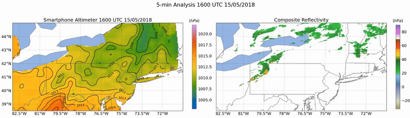

# meteo-krig

This repository provides code and example visualizations of techniques used in the methodology of McNicholas and Mass (2021a; in review) and McNicholas and Mass (2021b; in prep). 

Multi-resolution kriging (LatticeKrig; Nychka et al., 2015) is used to generate 5-km gridded analyses of sea level pressure (altimeter), every 5-minutes. These analyses are generated using [MADIS](https://madis.ncep.noaa.gov/madis_sfc.shtml) pressure observations, which include pressure observations from [METARs](https://madis.ncep.noaa.gov/madis_metar.shtml) and [Mesonets](https://madis.ncep.noaa.gov/madis_mesonet.shtml). To account for the temporal variability of MADIS observation density/frequency, Kalman smoothing is performed. Kalman smoothing transforms geo-spatial pressure analyses, generated with LatticeKrig, into spatio-temporal pressure analyses that are consistent in both space and time. 

The code provided in this repository demonstrates this methodology, wherein pressure observations are analysed using LatticeKrig, smoothed using a Kalman Smoother, and band pass filtered to extract mesoscale pressure perturbations. In McNicholas and Mass (2021a; in review) this approach to pressure analyses is utilized for both MADIS and smartphone pressure observations. In McNicholas and Mass (2021b; in prep), this methodology is extended to MADIS temperature, moisture, and wind observations facilliting the analysis, tracking, and characterization of mesoscale pressure features. 

### Setup

Please read the **SETUP.txt** file before attempting to run the jupyter notebooks provided in this repository. This file contains
instructions for setting up an R/Python conda environment containing the packages used in jupyter notebooks. In addition, please download the data.tar.gz available [here](https://drive.google.com/file/d/1q418t9YtHSTO01FbQH-eCprvaReaf2XU/view?usp=sharing). This archive contains MADIS pressure and radar analyses used in jupyter notebook examples.

### Notes about MADIS:
Additional observations, not available to the public, are provided to researchers by the Meteorological Data Assimilation Ingest System ([MADIS](https://madis.ncep.noaa.gov/)). In McNicholas and Mass (2021a; 2021b), MADIS Research observations were used to generate pressure analyses. The data archive contains pressure analyses generated with MADIS Research observations but not the raw data (i.e., point observations). MADIS Research observations cannot be redistributed since they contain Mesonet observations [prohibited](https://madis.ncep.noaa.gov/madis_restrictions.shtml) from redistribution. For this reason, point-observations in the data archive are limited to MADIS pressure observations approved for public release.

#### [Notebooks](https://nbviewer.jupyter.org/github/cmac994/meteo-krig/tree/master/notebooks/)

- [*Surface Analysis*](https://nbviewer.jupyter.org/github/cmac994/meteo-krig/tree/master/notebooks/SurfaceAnalysis/)
   - [Kriging](https://nbviewer.jupyter.org/github/cmac994/meteo-krig/tree/master/notebooks/SurfaceAnalysis/Kriging/)   
      - Demonstrates the use of the LatticeKrig R package for interpolating *in situ* surface observations from MADIS onto a 5-km regular grid.

   - [RTS_Analysis](https://nbviewer.jupyter.org/github/cmac994/meteo-krig/tree/master/notebooks/SurfaceAnalysis/RTS_Analysis/)
      - Shows how Kalman smoothing is used to transform 5-min pressure analyses, generated individually with LatticeKrig, into 
      spatio-temporal pressure analyses by smoothing windowed time-series at each grid point in the domain.
      A comparison to METAR observations is provided at three sites (one urban, one suburban, and one rural).
      Kalman Smoothing has a minimal impact on absolute accuracy, but greatly improves relative accuracy which is important for pressure perturbation analysis
      - Provides examples for pressure, temperature, moisture, and wind which show the end result of kriging and Kalman smoothing. A comparison between surface analyses   
      generated using MADIS Research observations and publicly available MADIS observations is also performed.

   - [*SurfaceAnalysis.ipynb*](https://nbviewer.jupyter.org/github/cmac994/meteo-krig/blob/master/notebooks/SurfaceAnalysis/Surface_Analysis.ipynb)
      -  Combines smarpthone pressure analyses with composite reflectivity and MADIS analyses of temperature, mositure, and wind to create gridded objective analyses.
      -  Demonstrates how mesoscale temperature, moisture, and wind perturbations are extracted from MADIS analyses using band-pass filtering. 
      -  Produces animations depicting the evolution of mesoscale perturbations associated with two high-impact weather events in the Mid-Atlantic region between 14-15 May 2018.

- [*Feature Tracking*](https://nbviewer.jupyter.org/github/cmac994/meteo-krig/tree/master/notebooks/FeatureTracking/)
   - [*Pressure_Perturbation_Analysis.ipynb*](https://nbviewer.jupyter.org/github/cmac994/meteo-krig/blob/master/notebooks/FeatureTracking/Pressure_Perturbation_Analysis.ipynb)
      - Reveals how mesoscale pressure perturbations are extracted from smartphone pressure analyses using band-pass filtering. Composite reflectivity is shown beside 
      altimeter analysis and band-pass filtered (mesoscale) pressure perturbations to show how smartphone analyses captured convective phenomena during the 14-15 May derecho 
      event.

   - [*Perturbation_Tracking*](https://nbviewer.jupyter.org/github/cmac994/meteo-krig/blob/master/notebooks/FeatureTracking/Perturbation_Tracking.ipynb)   
      - Perform feature tracking of mesoscale pressure perturbations using [scikit-image](https://github.com/scikit-image/scikit-image), [hagelsag]
      (https://github.com/djgagne/hagelslag), and [trackpy](https://github.com/soft-matter/trackpy).
      - Illustrates feature tracking by animating feature tracks overlaid atop mesoscale pressure perturbations during the 14-15 May derecho event.

- [*Case Studies*](https://nbviewer.jupyter.org/github/cmac994/meteo-krig/tree/master/notebooks/CaseStudies/)
   - [CaseI](https://nbviewer.jupyter.org/github/cmac994/meteo-krig/tree/master/notebooks/CaseStudies/CaseI/): Long-lived Mesoscale Convective System 
   - [CaseII](https://nbviewer.jupyter.org/github/cmac994/meteo-krig/tree/master/notebooks/CaseStudies/CaseII/): Landfall of Hurricane Michael
   - [CaseIII](https://nbviewer.jupyter.org/github/cmac994/meteo-krig/tree/master/notebooks/CaseStudies/CaseIII/): Atmospheric Gravity Wave
  
   - [*Perturbation Analysis*](https://nbviewer.jupyter.org/github/cmac994/meteo-krig/blob/master/notebooks/CaseStudies/CaseI/CaseI_MCS_Perturbation_Analysis.ipynb)
      - Show hybrid objective analysis displaying MADIS observations overlayed with pressure contours from smartphone analyes and temperature/dew point contours from MADIS 
      anlyses during the case study event.
      - Display gridded surface analysis using smartphone pressure analyses and MADIS analyses of temperature, dew point, and wind.
      - Plot mesoscale surface perturbation analyses derived from band-passed filtered smartphone pressure analyses and MADIS analyses of temperature, dew point, and wind.

   - [*Composite and Wavelet Analysis*](https://nbviewer.jupyter.org/github/cmac994/meteo-krig/blob/master/notebooks/CaseStudies/CaseI/CaseI_MCS_Composite_and_Wavelet_Analysis.ipynb)
      - Define Methodological functions for band pass filtering, feature tracking, cross-correlation lag analysis, beamsteering, and wavelet analysis
      - Retrieve and plot composite analyses of pressure, temperature, humidity, and wave-normal wind perturbations for given case study
      - Demonstrate how cross-correlation lag analysis and beamsteering are used to estimate phase speed and wave-normal wind components.
      - Perform wavelet analysis and cross wavelet analysis to evaluate multi-scale relationships between pressure, temperature, humidity, and wind perturbations. Calculate and 
      display wavelet cross correlation, coherence, and phase at all feature track points and at the dominant scale of the observed pressure feature

#### References:

McNicholas, C., C. Mass, 2021a: Bias Correction, Anonymization, and Analysis of Smartphone Pressure Observations with Machine Learning and Multi-Resolution Kriging. *Journal of Weather and Forecasting*, (submitted).

McNicholas, C., C. Mass, 2021b: Tracking, Classification, and Analysis of Mesoscale Pressure Phenomena observed by Smartphones. (in prep).

Nychka, D., Bandyopadhyay, S., Hammerling, D., Lindgren, F. and Sain, S. (2015). A multiresolution Gaussian process model for the analysis of large spatial datasets. *Journal of Computational and Graphical Statistics* 24 579–599. https://doi.org/10.1080/10618600.2014.914946.

Nychka, D., Hammerling, D., Sain, S., Lenssen, N., 2016. Latticekrig: Multiresolution kriging based on markov random fields, R package version 8.4. https://github.com/NCAR/LatticeKrig.
